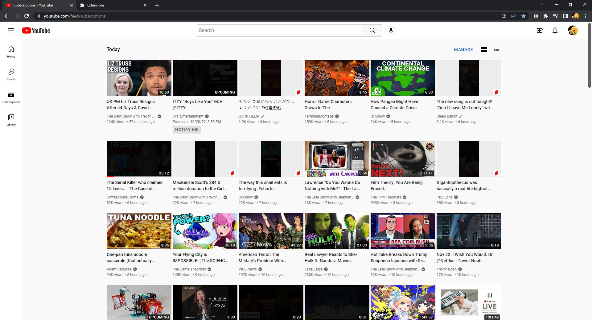
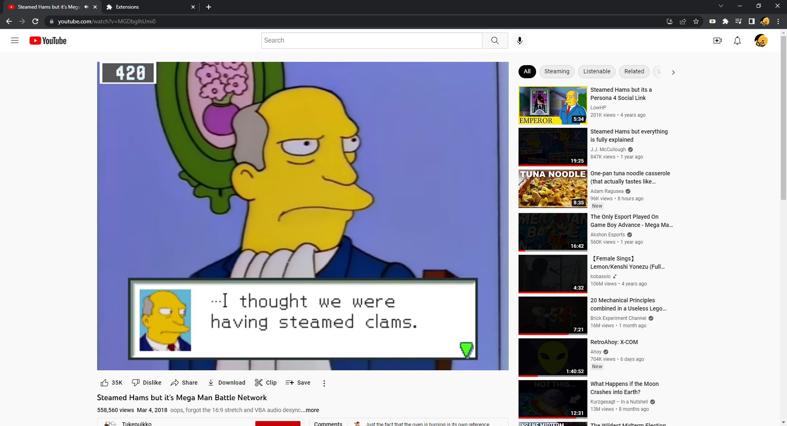

# MyYouTube

YouTube, for me.

# Description

The extension scrapes `https://*.youtube.com/*` to apply QoL styles to my preference. This includes:

1. Applies `darken` style on video thumbnails depending on if the video:

   - Is a YouTube Shorts
   - Has already been watched (has progress bar)
   - Contains text that has been blacklisted

2. Moves the menu bar above the video title.

Open [content.js](content.js) to modify the config to your liking.

# Installation

1. Download and extract [MyYouTube](https://github.com/peterthehan/my-youtube/archive/refs/heads/main.zip).
2. Navigate to `chrome://extensions` from your address bar.
3. Enable `Developer mode` located in the top-right corner.
4. Drag-and-drop the extracted folder into the Extensions page.

Happy YouTubing! 🎉
